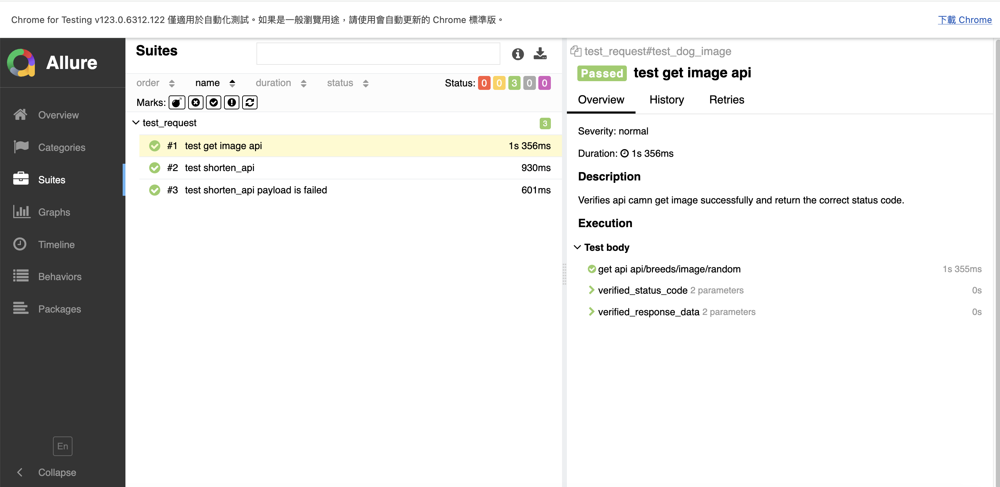
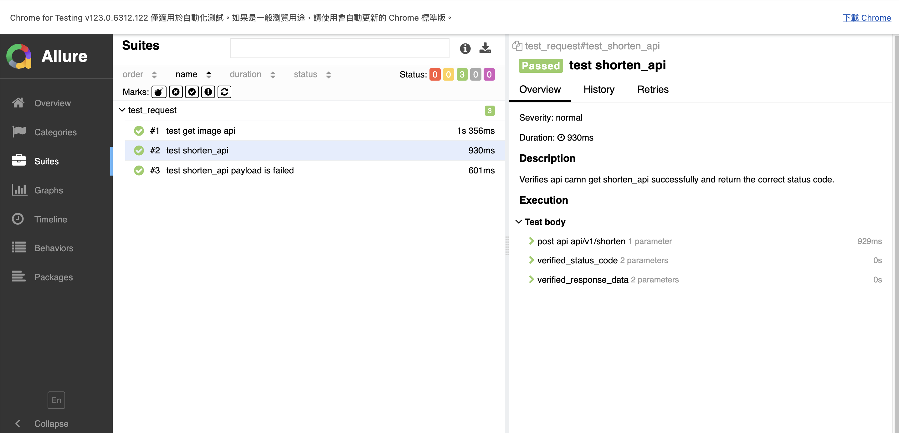
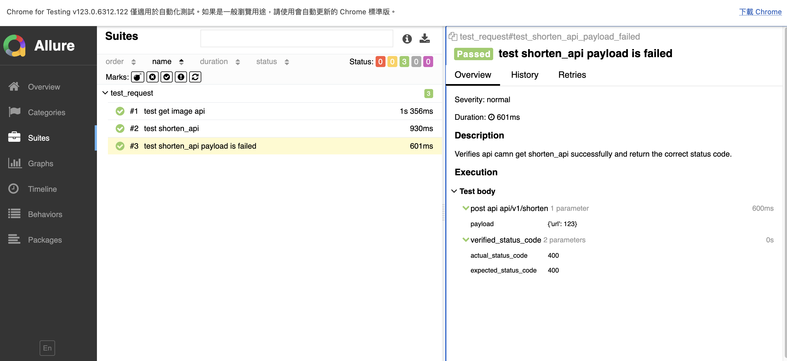

# api_homework
## **API Test Cases**

### **Test Case 1: Get - Dog Image API**

| **Step** | **Action** | **Expected Result** |
|----------|------------|---------------------|
| 1 | Call  `dog_image` API function to get response. | Can get response and status code. |
| 2 | Verify the status code is `200`. | The status code should be `200`. |
| 3 | Verify response data the url`https://images.dog.ceo/` can in `message` key. | The url`https://images.dog.ceo/`should be in `message` key. |

### **Test Case 2: POST - Shorten API: Pass**

| **Step** | **Action** | **Expected Result** |
|----------|------------|---------------------|
| 1 | Call `shorten_api` API function with url and pyload. | Can get response and status code. |
| 2 | Verify the status code is `200`. | The status code should be `200`. |
| 3 | Verify response data the url`https://cleanuri.com` can in `result_url` key. | The url`https://cleanuri.com`should be in `result_url` key. |

### **Test Case 3: POST - Shorten API: Negative**

| **Step** | **Action** | **Expected Result** |
|----------|------------|---------------------|
| 1 | Call `shorten_api` API function and put wrong type data in pyload . | Can get response and status code. |
| 2 | Verify the status code is `400`. | The status code should be `400`. |

